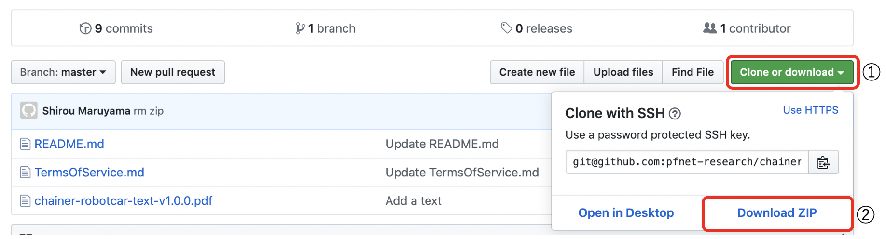

# ロボットカーで学ぶ深層学習の基礎
- 本テキストは、株式会社Preferred Networks（以下、PFN）と国立大学法人山梨大学の共同研究として開発された教材をベースに、より間口を広くして、高等専門学校から大学学部レベルの学生の方々に、深層学習に興味を持っていただく内容になっています。
- 教育機関での授業や、個人の自主学習用など、深層学習を学びたい方に学習機会を広く提供するため無料でご利用いただけます。ただし、商用利用はできませんのでご注意ください。
- 詳しくは[利用規約](TermsOfService.md)をご参照ください。

## ダウンロード方法
1. `Clone or download`をクリックする。
2. `Download ZIP`をクリックしてzipファイル(`chainer-robotcar-text-master.zip`)をダウンロードする。
3. zipファイルを展開して、テキスト(`chainer-robotcar-text-version.pdf`)をビューワーで開く。

© 2019 Preferred Networks, Inc. and UNIVERSITY of YAMANASHI, All Rights Reserved. 
本テキスト・画像の無断転載・複製を固く禁じます。二次利用不可、商用利用不可、但し教育機関の利用は可能。 
Chainer™は、株式会社Preferred Networksの日本国およびその他の国における商標または 登録商標です。
